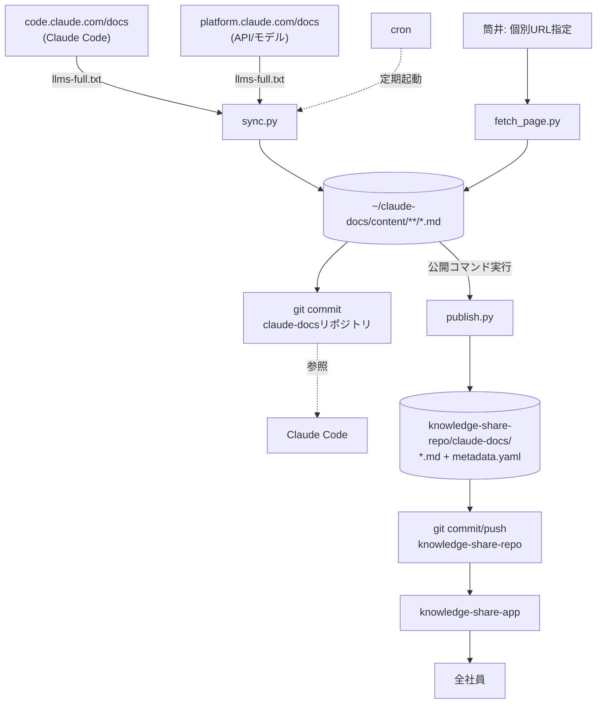
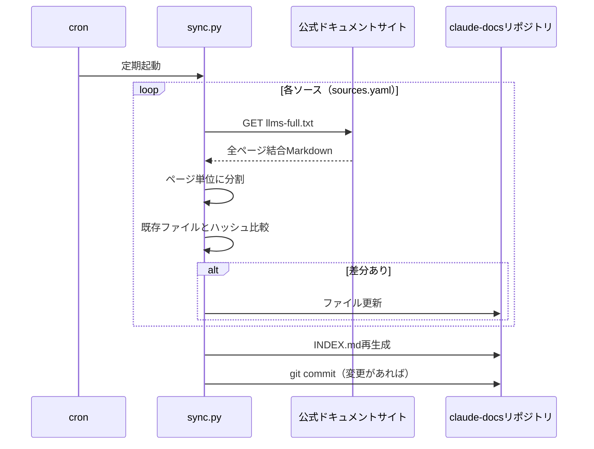
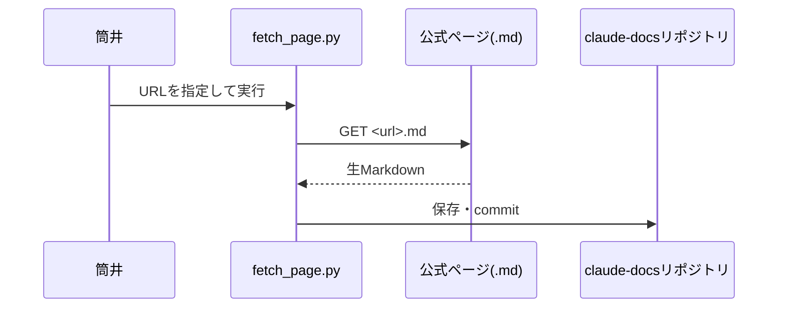
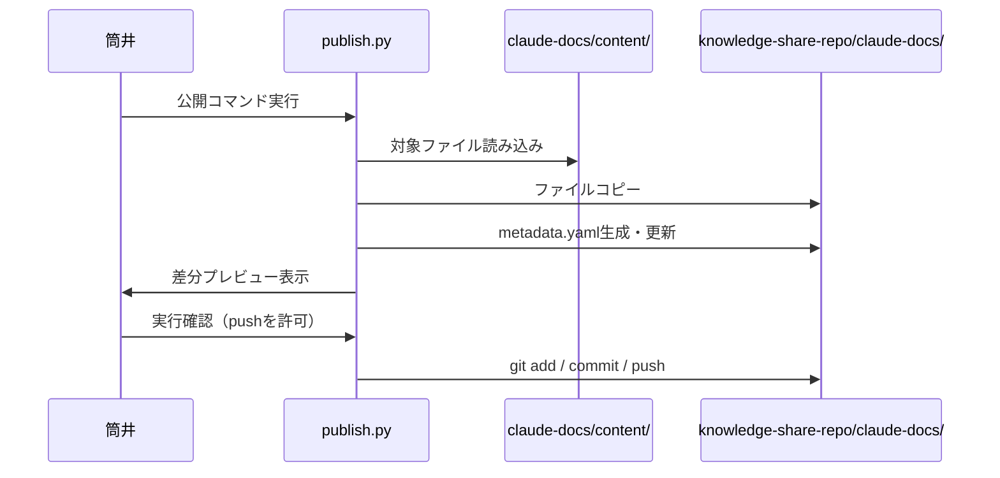

# 機能設計書

## 機能ごとのアーキテクチャ

本プロダクトは大きく2つの独立したフローで構成される。

1. **同期フロー**: 公式ドキュメントサイト → `~/claude-docs`（個人リポジトリ）。cronによって自動実行され、人手を介さない。
2. **公開フロー**: `~/claude-docs` → `knowledge-share-repo`（全社共有リポジトリ）。筒井が明示的にコマンドを実行したときのみ動く。差分プレビュー→実行確認を挟んでからgit pushする。

この2つを分離することで、「Claude Codeからの参照用に鮮度を保つ」ことと「全社への公開タイミングを筒井がコントロールする」ことを両立する。

## システム構成図

## データモデル定義

DB を持たないファイルベース設計のため、古典的なER図の代わりに主要ファイルのスキーマを定義する。

### `sources.yaml`（同期対象の定義）

| フィールド | 説明 |
|---|---|
| `name` | ソースの識別名（`content/`配下のサブディレクトリ名にもなる） |
| `full_dump` | `llms-full.txt`のURL |
| `page_base_url` | 個別ページ`.md`取得時のベースURL |

### `content/<source>/<page>.md`（同期される各ドキュメント）のfrontmatter

| フィールド | 説明 |
|---|---|
| `source_url` | 取得元の公式ページURL |
| `fetched_at` | 最終取得日時（ISO 8601） |
| `content_hash` | 本文のハッシュ値（差分検知に使用） |

### `INDEX.md`（自動生成される索引）

`content/`配下の全ファイルを、ソースごとにグループ化し、タイトル・`fetched_at`・相対パスの一覧として出力する。

### `knowledge-share-repo/claude-docs/metadata.yaml`（公開時に生成・更新）

`knowledge-share-repo`側の既存フォーマットに準拠する（`docs/repository-structure.md`で詳細化予定）。

| フィールド | 必須/任意 | 説明 |
|---|---|---|
| `path` | 必須 | `claude-docs/`からの相対パス |
| `title` | 必須 | ドキュメントのタイトル（frontmatterやMarkdown見出しから抽出） |
| `description` | 必須 | 簡潔な説明（自動生成、必要に応じ手動調整） |
| `tags` | 任意 | 例: `[claude-code]`, `[api]`, `[models]` |
| `updated_at` | 任意 | 同期元の`fetched_at`を転記 |
| `owner` | 任意 | `ai-lab`固定を想定 |

## コンポーネント設計

| コンポーネント | 役割 |
|---|---|
| `scripts/sync.py` | `sources.yaml`を読み込み、各ソースの`llms-full.txt`を取得。ページ単位に分割し、ハッシュが変わったファイルのみ更新。`INDEX.md`を再生成し、変更があれば`claude-docs`リポジトリにgit commitする |
| `scripts/fetch_page.py` | 指定された単一URLの`.md`を取得・保存する。差分検知・commit処理は`sync.py`と共通ロジックを再利用する |
| `scripts/lib/splitter.py` | `llms-full.txt`を`# タイトル` + `Source: URL`の2行区切りでページ単位に分割する共通ロジック |
| `scripts/lib/frontmatter.py` | Markdownファイルのfrontmatter読み書きユーティリティ |
| `scripts/publish.py` | `content/`配下の対象ファイルを`knowledge-share-repo/claude-docs/`にコピーし、`metadata.yaml`を生成・更新する。差分をプレビュー表示し、実行確認後に`knowledge-share-repo`側でgit commit・pushする |
| cron | OSのcron（`schedule`スキル経由）から`sync.py`を定期起動する |

## ユースケース図・画面遷移図・ワイヤーフレーム

本プロダクトはCLI/バッチ処理のみで構成され、GUIを持たない。該当セクションの代わりに、主要ユースケースをシーケンス図で示す。

### ユースケース1: 定期同期

### ユースケース2: 個別URL追加

### ユースケース3: 全社への公開

## API設計（外部エンドポイント）

自前のAPIは持たず、Anthropic公式サイトが提供する以下のエンドポイントを読み取り専用で利用する。

| ソース | エンドポイント | 用途 |
|---|---|---|
| Claude Code | `https://code.claude.com/docs/llms.txt` | 全ページの索引取得 |
| Claude Code | `https://code.claude.com/docs/llms-full.txt` | 全ページ本文の一括取得（同期のメイン経路） |
| Claude Code | `https://code.claude.com/docs/en/<path>.md` | 個別ページの生Markdown取得 |
| API/モデル | `https://platform.claude.com/docs/llms.txt` | 全ページの索引取得 |
| API/モデル | `https://platform.claude.com/docs/llms-full.txt` | 全ページ本文の一括取得 |
| API/モデル | `https://platform.claude.com/docs/en/<path>.md` | 個別ページの生Markdown取得 |

いずれもHTMLパース不要な生Markdownレスポンスであり、認証は不要。リクエスト頻度はcronの実行間隔（少なくとも週1回、目標は毎日）に準拠する。
